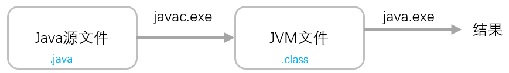

# 总结昨日

***markdown - 半个小时***

* jvm - 跨平台性(java语言),但是jvm是不跨平台的

   

* 执行的流程

   

* jdk和jre和jvm

   

# 变量

java中就是使用**变量和数据类型**来定义和存储数据的.数据存储的介质 - 磁盘和内存.

内存中的数据需要持久化[保存]到磁盘中.编程的核心就是对数据进行CRUD操作[create,retrieve,update,delete]

增删改查.

现阶段:数据都是在内存中的.java只能操作内存中的数据.

## 变量的分类

* ***基本数据类型***

  常规说法是八大种(byte,short,int,long,float,double,char,boolean)

  ***编程思想***书籍中将void归类为基本数据类型[九大基本数据类型].

* 对象类型

  * 内置对象类型(jdk中已经内置的) - 比如System,String,Date...
  * 自定义对象类型[开发者自己写的] - **无数种**

# 基本数据类型图

byte,short,int,long - 表示整数的

float和double都是用来表示小数的.**只是double会比float多消耗两倍的内存空间.**

 

# 变量定义和使用

变量的命名请参考类的命名,唯一的区别,推荐使用小驼峰命名.[helloWorld]

~~~java
语法:
数据类型 变量名 [= 初始值];
定义一个int类型的变量,并且初始值设置成10;

//代码的背后
//
int i = 10;
~~~

## 变量的赋值方式

* 在定义变量的同时进行赋值操作

* 可以先声明一个变量,然后再进行赋值,但是需要注意的是

  变量在使用之前,一定要先进行初始化操作.

* 可以进行统一赋值

  int x=10,y=20,z=30;

* 可以进行链式赋值

  ~~~java
  int x,y,z;//同时声明了三个变量
  x = y = z = 100;
  ~~~

* 可以通过表达式进行赋值

  表达式:由变量或者字面量以及运算符组成的合法的语句.

  ~~~java
  int a = 100;
  int result = a + 1;
  ~~~

* 可以通过方法进行赋值[暂时了解]

  可以将一个方法的调用的结果赋值给一个变量

# 类型的转换

简介:java中看到一个整数,默认的就是int类型,看到一个小数,默认的就是double类型.

并且,不同的数据类型在进行计算的时候,计算得到的结果是偏向大的一方.

## 自动类型转换

简介:小的数据类型可以自动转换成大的数据类型.**变量提升**

byte->short->int->long

int->double

char->int

## 强制类型转换

简介:大的数据类型在转换成小的数据类型时候会有精度的丢失,需要进行强制类型转换.

防止在程序的运行期间出现问题.所以在编译期间就要进行强制类型转换的处理.

***大的数据类型 变量max = 初始值;***

***小的数据类型 变量min = (小的是类型)变量max;***

## 隐式转换

* int类型 -> long类型

  why? 在整数后面加上l/L

* double -> float

  推荐在小数后面加上f/F

* 小数d/D

  定义double类型的数据. - 提高程序的可读性.

# char类型

简介:在java中使用char类型(基本数据类型)来表示单个字符,使用单引号来表示.

java中使用双引号来表示字符串(java.lang.String类型,属于内置对象类型),**字符串的本质**

**就是字符数组.**

笔试题:char类型能不能保存一个汉字?为什么? - char类型使用的内码是什么(unicode)?

java的底层使用的内码就是**unicode编码**(采用2个字节来进行存储的,0~65535)

外码 - 流中的编码和前环境的是有关系的.

## 变量的作用域

* **局部变量** - 变量是定义在方法体中(比如main方法)

  生命周期仅仅是存在它所在的那个{}中 - 开始调用方法 - 方法运行结束.

* **全局变量**

  定义在方法体外部的,直接定义在类中的.

## 特殊符号

~~~java
// \n和\r
// \n = 换行 - 当输入完毕之后,光标是停在下一行的起始位置
// \r = 回车 - 当输入完毕之后,光标是停在当前行的起始位置

// \b 代表一个退格
System.out.println("AAA\bCC");//AACC

// \" 双引号
// \' 单引号
System.out.println("\"");

// \
System.out.println("\\");// \

// \\
System.out.println("\\\\");

System.out.println("他说:\"穷是一种病\"");

System.out.println("D:\\temp\\emp");

// \t 制表符 - tab[正常是四格]
System.out.println("D:\temp\news");
~~~

# 进制换算

* 十进制(正整数)和二进制

  * 十进制->***二进制***

    规则:把十进制的数不断除以**2**,直到除到商是0为止,然后倒过来取余数.

* **八进制和二进制的换算**

  * 十进制->八进制

    规则:把十进制的数不断除以8,直到除到商是0为止,然后倒过来取余数 -> 还要再余数加上0

    java中规定了八进制的数据是以0开头.

    十进制26->八进制032

  * 八进制->十进制

    032 = 26

  * 二进制->八进制

    从右边开始每3个为一组,然后分别计算出每组的对应的十进制的数.如果最高位不足3位,全部补0

    010 101 010 111->02527

  * 八进制->二进制

    原则:就是把八进制中的每个数据转换成对应的二进制(3位)

    032 -> 011010

* **十六进制和二进制的换算.**

  **0x1ab1**

  十六进制由数字0-9以及A-F(a-f)组成[10-15]

  * 二进制->十六进制

  * 十六进制->二进制

    

# 运算符

## 算术运算符

~~~java
+ java中唯一重载的运算符[具有多重含义],如果出现的是纯数字之间表示的是加法计算
  如果出现了字符串(String)就表示拼接

- 减法

= 赋值
  
* 乘号
  
/ 除法[纯整数->取整]
  
% 取余[取模]
  
/和%一起使用可以分割任意一个数字
  
++和--
前++,后++
前--,后--
  
+=,-=,/=,%=,*=
~~~

## 比较运算符

比较下来的结果都是布尔类型boolean

~~~java
> < >= <= != ==
~~~

## 逻辑运算符

* 逻辑与&&(短路与)

  作用:连接判断条件的.不具备运算的功能.当所有的条件都是true的时候,才返回true;

  短路的特性 - 当左边的表达式已经能够决定整个结果的时候,那么后面的表达式将不会继续执行.

  使用时注意:将条件表达式最有可能结果是false的放在最左边.

* 逻辑或||(短路或)

  作用:连接判断条件的.不具备运算的功能.只要出现一个true,结果就是true

  短路的特性 - 当左边的表达式已经能够决定整个结果的时候,那么后面的表达式将不会继续执行.

  使用时注意:将条件表达式最有可能结果是true的放在最左边.

## 位运算符

~~~java
& - 按位与,非短路与
    1 - 进行&运算[真正的作用] - 都是1的时候,才是1;
    2 - 连接条件表达式的 - 所有的表达式都是true,才是true.
        非短路性 - 所有的表达式都会执行.
  
10 & 8 = 8
  
   1 0 1 0
 & 1 0 0 0 
 -----------
   1 0 0 0

| - 按位或,非短路或
    1 - 进行|运算[真正的作用] - 只要出现1,结果就是1
    2 - 连接条件表达式的 - 只要出现true,才是true.
        非短路性 - 所有的表达式都会执行.
      
10 | 8 = 10
  1 0 1 0
| 1 0 0 0 
 -----------
  1 0 1 0
      
^ 异或 - 相同为0,不同为1
10 ^ 8 = 2
      
 1 0 1 0
^1 0 0 0 
 -------
 0 0 1 0
      
10 ^ 8 ^ 8 = 10
 0 0 1 0
^1 0 0 0
--------
 1 0 1 0
      
结论:一个数连续异或同一个数俩次,结果是它本身.进行简单的加密和解密操作.
  
~ 取反,0变成1,1变成0
~9 = -10

结论:~x=-(x+1)
  
00000000 00000000 00000000 00001001
11111111 11111111 11111111 11110110 -> 负数
  
>>> 不带符号的右移动,移动了多少位,就在最高位补0
>> 带符号的右移动,移动了多少位,就在最高位补符号位
  
-10 >>> 2
11111111 11111111 11111111 11110110 >>> 2
00111111111111111111111111111101=1073741821
  
-10 >> 2
11111111 11111111 11111111 11110110 >> 2
11111111 11111111 11111111 11111101 = ~2 = -3
  
取反
00000000 00000000 00000000 00000010
  
<< 左移动
笔试题:请你以最高性能的方式计算出2的3次方!
2 << 2
0010 << 2
1000  = 8
~~~

### 负数的二进制表现形式

正数的原码,补码,反码都是它本身.

负数在计算机中的表现形式就是它的补码.

负数的补码 = 反码(对原码进行符号位不变,其余位依次取反) + 1;

***反码存在的意义就是为了求补码***

求出-10的补码

* -10的原码

  10000000 00000000 00000000 00001010

* -10的反码

  11111111 11111111 11111111 11110101

* 反码+1 = 补码

  ~~~java
  11111111 11111111 11111111 11110101
                                   +1
  ---------------------------------------
  11111111 11111111 11111111 11110110  = ~? = -(?+1)
  00000000 00000000 00000000 00001001 = 9
  ~~~

# 类文件

一个类文件中是允许定义多个class,但是这些class不能使用public修饰.

# final关键字

简介:final代表的是不可变的

final修饰的变量 - 常量(不可改变的量) - ***final修饰的变量会放入到JVM内存中常量池中.***

常量的命名全部采用大小字母组成,并且如果出现多个单词,使用_隔开.

讲究见名知意

