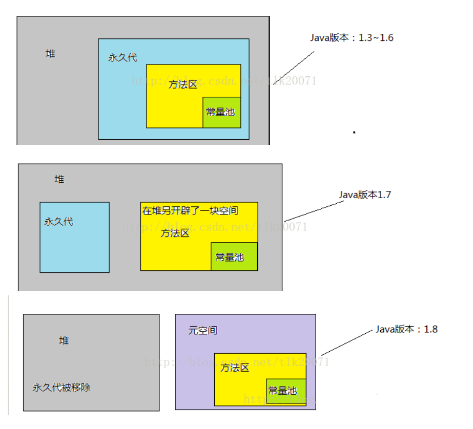

# JVM

简介:本章课程,同学们了解即可.

## 定义

JVM是Java Virtual Machine（Java虚拟机)的缩写.

引入Java语言虚拟机后，Java语言在不同平台上运行时不需要重新编译。Java语言使用Java虚拟机屏蔽了与具体平台相关的信息，使得Java语言[编译程序]只需生成在Java虚拟机上运行的目标代码（[字节码]），就可以在多种平台上不加修改地运行. 

***争议:Java是解释型语言,还是编译型的语言,还是两者兼之?***

编译型语言? - C语言,直接将这个语言编写的源程序***编译***成底层的机器语言.

**Java是解释型语言!**

## 图示

  

如上图所示，首先Java源代码文件(.java后缀)会被Java编译器编译为字节码文件(.class后缀)，然后由JVM中的类加载器加载各个类的字节码文件，加载完毕之后，交由JVM执行引擎执行。在整个程序执行过程中，JVM会用一段空间来存储程序执行期间需要用到的数据和相关信息，这段空间一般被称作为Runtime Data Area（运行时数据区），也就是我们常说的JVM内存。因此，**在Java中我们常常说到的内存管理就是针对这段空间进行管理**（如何分配和回收内存空间）。

# 运行时数据区结构

 

## 发展

 

***注意:JDK8.x将永久代剔除了,取而代之的是元空间(meta space)***

~~~java
final int a = 10;//使用final关键字修饰的局部变量-常量(出现在方法体中)
								//修饰的是成员变量 - 常量属性

//尚未学到的字符串,字符串的构建方式,利用字符串常量池的构建方式
//java.lang.String - 不可变的 - private final char[] values;
//字符串习惯叫做字符串常量
String s = "hello";//String s = new String("hello");
//都会在字符串常量池(ldc指令) - 存放字符串值

直接量10和直接量"hello"放在堆里面吗? - 不是!!!
肯定是放在JVM内存的常量池中!!! - 常量池存在于方法区中,方法区到了Jdk8.x的时候,它不在堆中,而是在元空间!
~~~

~~~java
javap -c StringDemo
~~~

查看汇编指令

## 虚拟机栈

虚拟机栈是用于描述java方法执行的内存模型。

**每个java方法在执行时，会创建一个“栈帧（stack frame）以执行的方法为单位”，栈帧的结构分为“局部变量表、操作数栈、动态链接(线程永远执行的栈顶的方法)、方法出口”几个部分**。我们常说的“堆内存、栈内存”中的“栈内存”指的便是虚拟机栈，确切地说，指的是虚拟机栈的栈帧中的局部变量表，因为这里存放了一个方法的所有局部变量。

**虚拟机栈是线程隔离的，即每个线程都有自己独立的虚拟机栈。**

方法调用时，创建栈帧，并压入虚拟机栈；方法执行完毕，栈帧出栈并被销毁.

| int - 32bit                 |      |      |
| --------------------------- | ---- | ---- |
| long - 搞2个块(分别是32bit) |      |      |
|                             |      |      |
|                             |      |      |

## 本地方法栈

本地方法栈的功能和特点类似于虚拟机栈，均具有线程隔离的特点以及都能抛出StackOverflowError和OutOfMemoryError异常。

不同的是，**本地方法栈服务的对象是JVM执行的native方法**，**而虚拟机栈服务的是JVM执行的java方法**。如何去服务native方法？native方法使用什么语言实现？怎么组织像栈帧这种为了服务方法的数据结构？虚拟机规范并未给出强制规定，因此不同的虚拟机实可以进行自由实现，我们常用的HotSpot虚拟机选择合并了虚拟机栈和本地方法栈。

## 程序计数器

**最快的存储区**，保存的是程序当前执行的指令地址，执行结束后，自动获取下一个指令，位于CPU处理器内部。数量极其有限，由编译器根据需求进行分配。java中，**不能直接控制**，也不能在程序中感觉到寄存器存在的任何迹象。

**了解：**CPU 1.80GHz（Hz是单位）即CPU运算时的工作频率（1秒内发生的同步脉冲数）的简称。从理论上讲CPU的主频越高，它的速度也就越快，因为频率越高，单位时钟周期内完成的指令就越多，从而速度也就越快了.

## 栈

存放基本类型的变量数据和对象的引用。速度仅次于寄存器。创建程序时候，JAVA编译器必须知道存储在栈内所有数据的确切大小和生命周期。**当线程执行一个方法时，就会随之创建一个对应的栈帧**，并将建立的栈帧压栈。当方法执行完毕之后，便会将栈帧出栈。栈帧：局部变量表，方法返回地址等

***此处的java栈 - 虚拟机栈中的"栈帧".***

特点:先进后出,空间一旦确定,不能动态改变.存储和读取速度比较快.

Student s = new Student();//s引用类型也是在栈中,大小是不确定的 - 1.操作系统,2.jvm优化.

## 堆

用来存储**所有new出来的对象。**关于空间释放，Java的垃圾回收机制会自动进行处理，**因此这部分空间也是Java垃圾收集器管理的主要区域**。在堆里分配存储有很大的灵活性。当你需要创建一个对象的时候，只需要new，一行简单的代码，当执行这行代码时，会自动在堆里进行存储分配。当然，为这种灵活性必须要付出相应的代价。**用堆进行存储分配比用栈进行存储需要更多的时间**。另外堆是被所有线程池共享的，在JVM中只有一个堆。

栈与堆的比较

- 栈(stack)与堆(heap)都是Java用来在Ram（random-access memory）中存放数据的地方。 
- **栈的优势是，存取速度比堆要快，仅次于直接位于CPU中的寄存器**。但缺点是，存在栈中的数据大小与生存期必须是确定的，缺乏灵活性。**堆的优势是可以动态地分配内存大小，生存期也不必事先告诉编译器，Java的垃圾收集器会自动收走这些不再使用的数据。但缺点是，由于要在运行时动态分配内存，存取速度较慢** 

## 方法区/静态存储区

**线程池共享的区域**，存放程序运行时一直存在的数据，存储已被虚拟机加载的每个类的信息（包括类的名称、方法信息、字段信息）静态变量（static修饰的成员变量）、常量、编译器编译后的代码（class文件）等。

## 常量存储区

声明为final的为常量，保存在常量储存区，还有String类型的对象都是常量，系统维护了一个**String常量池**，常量池存储在方法区中。

//Stirng s1 = "abc";

String s = new String("abc");//创建了几个对象  1或者2

String x = "a"+"b"+"c";//创建了几个对象 "a" "b" "ab" "c" "abc" 

## JDK8+ 拥有新生代、老年代

   

  

~~~java
//Eden - 伊甸园 - 一开始创建出来的所有的对象都是在这个区域的
//Eden:From:To - 8:1:1
Student s = new Student();//在堆空间中创建了一个对象
Student s1 = new Student();
//当内存中这个s对象诞生的时候,那么会优先存储在堆中的Eden区 - 伊甸园
//存储在Eden区中的对象 - 大部分都会死掉,能活下来的对象是很少的.

s = null;//原先创建的学生对象就变成了一个垃圾对象,被直接回收了...
//s2,s3,s4,...sn

//谁去做判断对象是否存活的工作? - GC - 检测到除了s是垃圾对象,其余的活着的对象全部进入到
//From(s2,s3,s4...sn)->GC时不时还会继续检测,发现s2,s3这俩个垃圾对象,回收!!!
//将活着的对象s4...sn采取复制算法,全部复制到To区域.然后把From区域清空
//GC时不时又会继续检测To区域(s4,s5又是垃圾对象) - 将或者的对象(s6...sn)又全部复制到From区域
//然后继续将To区域清空

//重复在From区域和To区域来回复制.如果某个对象经过了GC的15检测仍然还存活着,
//那么就会把这个对象放到老年代(存活率比较高的对象了)

//GC也要扫描老年代 - 标记整理算法 - 清除垃圾对象 - 把存活的对象移到内存的一端，然后把剩余的空间全部清空掉。
~~~

# GC

## 什么是垃圾回收

程序的运行必然需要申请内存资源，无效的对象资源如果不及时处理就会一直占有内存资源，最终将导致内存溢出，所以对内存资源的管理是非常重要了。
为了让程序员更专注于代码的实现，而不用过多的考虑内存释放的问题，所以，在Java语言中，有了自动的垃圾回收机制，也就是我们熟悉的GC。

***有了垃圾回收机制后，程序员只需要关心内存的申请即可，内存的释放由系统自动识别完成***。换句话说，自动的垃圾回收的算法就会变得非常重要了，如果因为算法的不合理，导致内存资源一直没有释放，同样也可能会导致内存溢出的。

垃圾回收机制,专门用来回收垃圾对象 

垃圾对象:没有任何引用指向的对象.

## 对象搜索法

垃圾回收，第一件事就是要搞清楚哪些东西是垃圾，而后才能对这些垃圾进行回收。

那么有什么办法识别对象是否为无用的垃圾呢？狭义地，怎么判断对象是否没被引用呢？

通常有以下两种算法去识别判断

### 引用计数

这个算法非常简单。给对象一个计数器，每当这个对象被引用了，计数器值加一；引用失效，则减一。但这个对象计数值为0的时候，证明是无用对象，可以被GC程序回收掉。这种算法比较广泛应用在一些脚本语言上，如FLASH、PYTHON等。
但是引用计数算法无法解决对象间相互引用的问题。当a对象引用了b对象，b对象也引用了a对象，这样a、b两个对象的计数器值都不会为0，即使这两个对象都被其他对象所引用，最终导致这些对象一直无法被回收。这种情况往往会出现在比较复杂的编程语言中。

**缺点:底层频繁进行计数加减,性能会低下.无法解决循环引用问题.**

通俗点讲:GC判断如果这个对象被引用一次,则+1,

~~~java
public class TestObject{
  public static void main(String[] args){
      //栈obj1  ->    堆对象new ObjectDemo();
     ① ObjectDemo obj1 = new ObjectDemo();//step1 -> obj1指向的对象A,引用计数+1;
      //obj1 = null;//对象A的计数器-1,计数值是0.说明是一个垃圾对象,也可以被GC进行回收.
    
      //ObjectDemo obj2 = obj1;//obj2 -> 对象A + 1,实例计数是2
      //obj1 = null;//对象A实例-1,实际是1.不是一个垃圾对象.
    
     ② ObjectDemo obj2 = new ObjectDemo();
     
     //循环引用.
     ③ obj1.instance = obj2;
     ④ obj2.instance = obj1;
    
     ⑤ obj1 = null;
     ⑥ obj2 = null;
    
     //解析:执行①,②,obj1实例和obj2对象各自+1
     //执行③,obj2实例+1,执行④,obj1实例+1
     //执行⑤,⑥,obj1实例-1,obj2实例-1.最终obj1和obj2的对应的计数值是1 - 仍然是不能够被回收的.
  }
}

public class ObjectDemo{
  public Object instance = null;
}
~~~

 

执行⑤⑥之后

  

 

### 可达性分析算法

可达性分析算法（GC roots算法），广泛应用于主流的商用语言。设置一个根节点，从图论角度来看，只要从该节点可达一个对象，证明这个对象是存活的（被引用）。

 说到GC roots（GC根），在JAVA语言中，可以当做GC roots的对象有以下几种：

- ***虚拟机栈（栈帧中的本地变量表）中引用的对象；***
- ***方法区中类静态属性引用的对象；***
- ***方法区中常量引用的对象；***
- 本地方法栈中JNI（即一般说的Native方法）引用的对象；

 

## 垃圾回收算法

简介:了解完垃圾是怎么找出来后，接下来看看它们是怎么被清除的。以下介绍几种清除的算法。

### 标记-清除算法

1 - 当GC发现需要释放内存空间的时候,JVM正在执行的程序将会进入等待状态.

2 - GC标注垃圾对象

3 - GC再去清理这些垃圾对象

4 - 清理完毕之后,JVM继续执行

简介:标记-清除算法（Mark-Sweep）

标记-清除，顾名思义，先标记垃圾，再清除。它是GC最基础的算法，后续很多算法都是基于它上面去改进的。
标记的过程在上面搜索GC对象已经介绍过了。被标记的对象，在统一GC的时候会把标记的对象清除掉。这个算法比较简单，不做过多赘述。

 

这个算法有一个很明显的缺点，就是在垃圾回收后会**产生大量不连续的碎片空间**，导致程序要申请较大的对象时常无法找到合适的内存空间，迫使再次GC。

### 复制算法

实际过程复制活着的对象,效率实际上是可以忽略的.实际活着的对象不足10%.

 

可以看到，这种算法有点新生代转移到老年代的感觉。

缺点：

1. **把内存可使用的空间减少了一半**，造成空间的浪费。
2. 对象存活数量较多的时候，复制性能比较差

这种缺点，在老年代中，对象存活率比较高的场景下是非常场景间。

### 标记-整理算法

简介:标记-整理算法(mark-compact)

针对复制算法的两个缺点，**在老年代一般会用这种标记-整理算法。**

把存活的对象移到内存的一端，然后把剩余的空间全部清空掉。

 

### 分代收集算法

简介:也叫做分代回收算法

分代算法并不是一个特定的算法，也没有什么新的内容。**而是把内存分成多个区域，一般为新生代、老年代等**。然后根据不同区域不同的特点，用不同回收算法去回收垃圾。

例如新生代，对象存活率低，比较适用复制算法(From,To)。老年代存活率高，比较适用Mark-Compact算法。